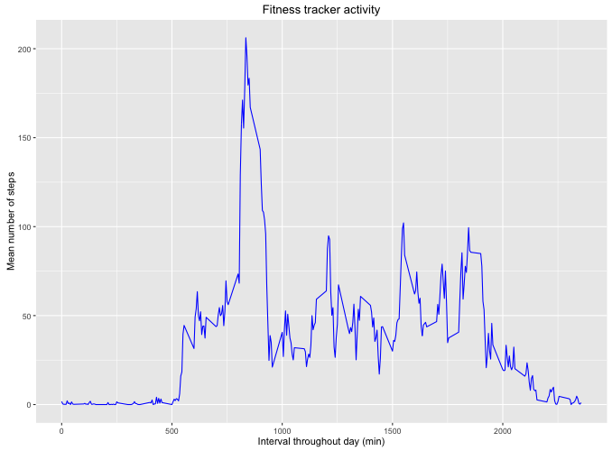
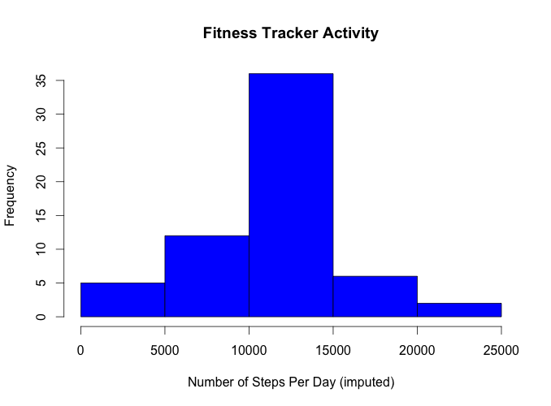
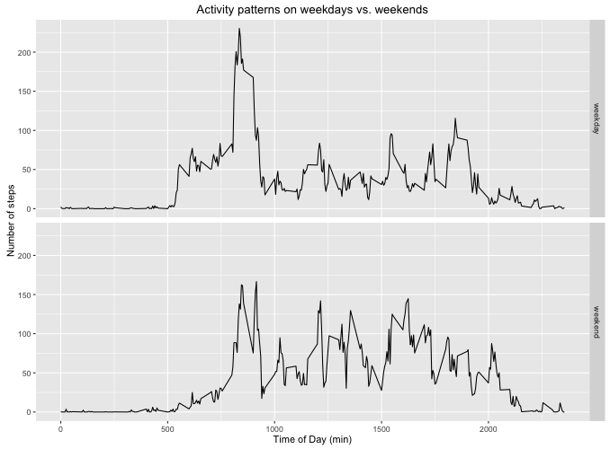

# Reproducible Research: Peer Assessment 1

## Libraries
Prerequisite libraries

```r
library(knitr, quiet=T)
library(plyr, quiet=T)  # For munging
library(ggplot2, quiet=T)  # For plotting
opts_chunk$set(dev="png", fig.path="figure/")
```

## Loading and preprocessing the data

Load the data.  Store the data both as a factor and as a POSIX date for later manipulation: 

```{r}
if (!file.exists("activity.csv")) stop("activity.csv not present")
activity <- read.csv("activity.csv", header=TRUE, 
                     colClasses=c("numeric", "character", "numeric"),
                     stringsAsFactors=FALSE)
activity$date.factor <- as.factor(activity$date)
activity$date <- as.Date(activity$date, format="%Y-%m-%d")
```


## What is mean total number of steps taken per day?
Sum steps per day:
```{r}
daily.steps <- tapply(activity$steps, activity$date, sum, na.rm=TRUE)
```

Plot the steps per day in a histogram:

```{r echo=FALSE}
hist(daily.steps, 20, main="Total number of steps taken per day", xlab="Steps per day")
```

```{r}
meansteps <- mean(daily.steps)
mediansteps <- median(daily.steps)
```

The mean and median per interval are:

```r
mn <- mean(activity$steps, na.rm=TRUE)
md <- median(activity$steps, na.rm=TRUE)
cat(paste("The mean number of steps per interval is", 
          format(mn, digits=4), "and the median is", 
          format(md, digits=2), "(ignoring missing values)"))
```

```
## The mean number of steps per interval is 37.38 and the median is 0 (ignoring missing values)
```

And per day (which is the question from the assignment)

```r
mn <- mean(activity.daily$total.steps, na.rm=TRUE)
md <- median(activity.daily$total.steps, na.rm=TRUE)
cat(paste("The mean number of steps per day is", 
          format(mn, digits=4), "and the median is", 
          format(md, digits=2), "(ignoring missing values"))
```

```
## The mean number of steps per day is 9354 and the median is 10395 (ignoring missing values)
```

## What is the average daily activity pattern?

Here we will take advantage of the fact that the interval variable
*wraps* at the end of each day.  Again, we are ignoring NA values.


```r
activity.pattern <- ddply(activity, "interval", summarize,
                          mean=mean(steps, na.rm=TRUE))
g <- ggplot(activity.pattern, aes(interval, mean))
g + geom_line(color="blue") + 
  labs(title="Fitness tracker activity", 
       x="Interval throughout day (min)",
       y="Mean number of steps")
```

 

What interval has the highest average number of steps?

```r
max.interval <- activity.pattern$interval[which.max(activity.pattern$mean)]
cat(paste("Interval corresponding to maximum average number of steps:",
          max.interval,"minutes"))
```

```
## Interval corresponding to maximum average number of steps: 835 minutes
```

## Imputing missing values

How many rows have missing values?  Note that this is not the
same as the number of missing elements if there are more
than two NAs in a row.

```r
nmissing <- sum(!complete.cases(activity))
cat(paste("Number of rows with missing data:", nmissing))
```

```
## Number of rows with missing data: 2304
```

We fill missing values for the number of steps with the mean number 
for that interval.   Note that this will make the steps non-integral.


```r
impute.value <- function(steps, interval) {
    if (is.na(steps)) {
        activity.pattern[activity.pattern$interval==interval,]$mean
    } else {
        steps
    }
}
imputed.activity <- activity
imputed.activity$steps <- mapply(impute.value, activity$steps, 
                                activity$interval)
```

And per day (which is the question from the assignment)

```r
mn <- mean(fitivity.daily$total.steps, na.rm=TRUE)
md <- median(fitivity.daily$total.steps, na.rm=TRUE)
cat(paste("The mean number of steps per day is", 
          format(mn, digits=4), "and the median is", 
          format(md, digits=2), "(ignoring missing values"))
```

```
## The mean number of steps per day is 9354 and the median is 10395 (ignoring missing values)
```

```r
cat(paste("For the imputed the mean and median per day are:",
          format(mean(total.steps.imputed)), "and", 
          format(median(total.steps.imputed))))
```

```
## For the imputed the mean and median per day are: 10766.19 and 10766.19
```

Make a histogram of the mean number per day after imputation.

```r
hist(total.steps.imputed, col="blue", main="Fitness Tracker Activity",
     xlab="Number of Steps Per Day (imputed)")
```

 

Check to make sure we filled in all the missing values:

```r
nmissing <- sum(!complete.cases(imputed.activity))
cat(paste("After imputation, number of rows with missing data:", nmissing))
```

```
## After imputation, number of rows with missing data: 0
```

## Are there differences in activity patterns between weekdays and weekends?

Add a factor variable for weekday vs. weekend:

```r
daytype <- function(date) 
    if (weekdays(date) %in% c("Saturday", "Sunday")) "weekend" else "weekday"
imputed.activity$day.type <- as.factor(sapply(imputed.activity$date, daytype))
```

And look at the mean number of steps per day per date type:

```r
steps.day.daytype <- ddply(imputed.activity, .(interval, day.type),
                           summarize, steps=mean(steps))
ggplot(steps.day.daytype, aes(interval, steps)) + 
    geom_line() + facet_grid(day.type ~ .) +
    labs(x="Time of Day (min)", y="Number of steps",
         title="Activity patterns on weekdays vs. weekends")
```

 

Yes, there are some difference between Weekend and Weekday patterns: weekdays usually have AM activity.